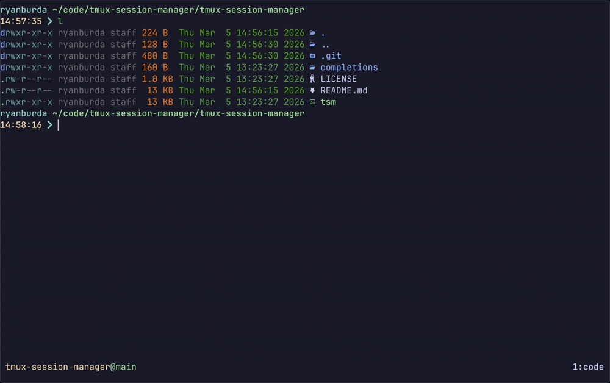
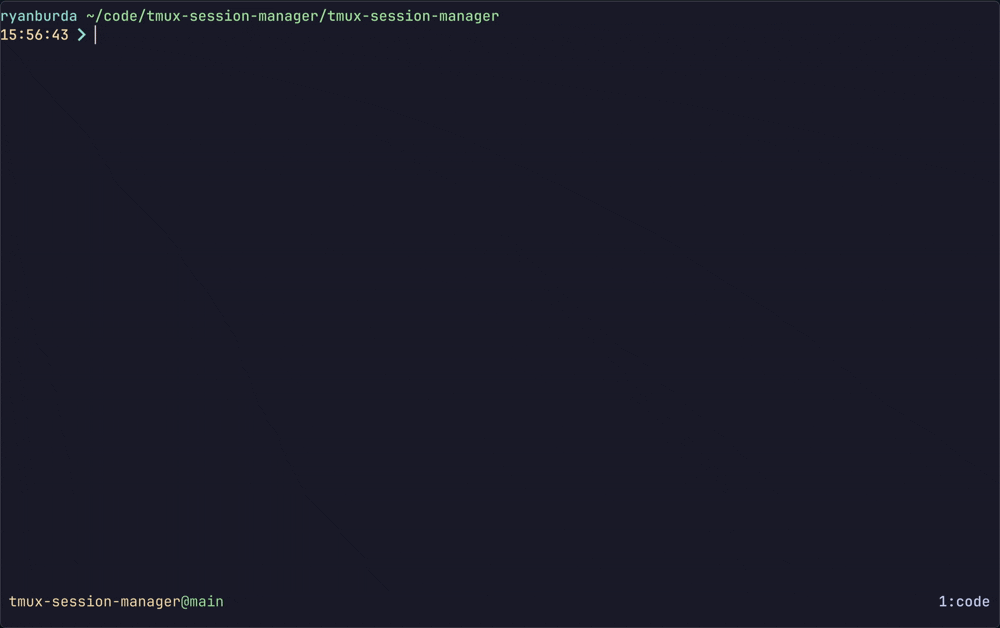
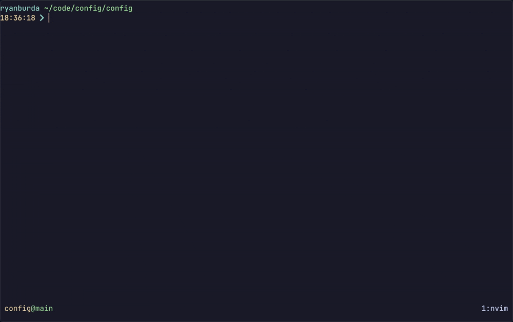
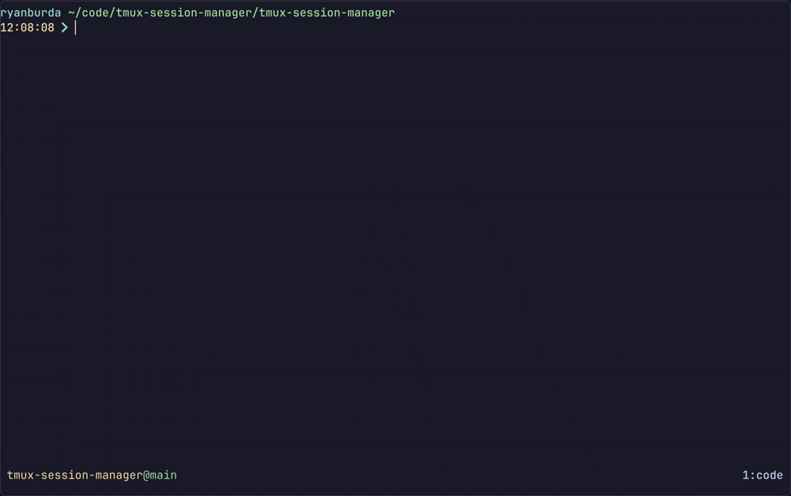

# tmux-session-manager

A simple tmux session manager

- **Create** sessions rooted at directories or defined by configuration scripts
- **Switch** between active sessions
- **Kill** sessions with optional cleanup scripts

## Dependencies

- `fzf`

## Installation

1. Clone the repository:
   ```bash
   git clone https://github.com/ryanburda/tmux-session-manager.git ~/git/ryanburda/tmux-session-manager
   ```

2. Symlink the `tsm` script to a directory in your PATH:
   ```bash
   mkdir -p ~/.local/bin
   ln -s ~/git/ryanburda/tmux-session-manager/tsm ~/.local/bin/tsm
   ```

3. Ensure `~/.local/bin` is in your PATH. Add this to your `.bashrc` or `.zshrc` if needed:
   ```bash
   export PATH="$HOME/.local/bin:$PATH"
   ```

4. (Optional) Install shell completions:

   Completions provide:
   - Active session names for `tsm` and `tsm -k`
   - Directory completion for `tsm -d`
   - Config names for `tsm -c`
   - Session names with logs for `tsm -l`

   <details>
   <summary><strong>Bash</strong></summary>

   Add to your <code>~/.bashrc</code>:

   ```bash
   source ~/git/ryanburda/tmux-session-manager/completions/tsm.bash
   ```

   </details>

   <details>
   <summary><strong>Zsh</strong></summary>

   Add to your <code>~/.zshrc</code>:

   ```bash
   fpath=(~/git/ryanburda/tmux-session-manager/completions $fpath)
   autoload -Uz compinit && compinit
   ```
   Or rename `tsm.zsh` to `_tsm` and place in an existing fpath directory.

   </details>

   <details>
   <summary><strong>Fish</strong></summary>

   Symlink to fish completions directory:

   ```bash
   ln -s ~/git/ryanburda/tmux-session-manager/completions/tsm.fish ~/.config/fish/completions/
   ```

   </details>

## Usage

```bash
tsm [session]                  # Switch to session
tsm -k, --kill [session]       # Kill session (run cleanup script if present)

# Directory based sessions
tsm -d, --dir [path]           # Create session at path
tsm -g, --git                  # Browse git repositories with fzf, creates session at path
tsm -w, --worktree [name]      # Create session at git worktree path
tsm -z, --zoxide [query]       # Create session for zoxide match path

# Configuration based sessions
tsm -c, --configured [config]  # Create configured session
tsm -l, --logs [session]       # Browse configured session logs

tsm -h, --help                 # Show help message
```

When session/path arguments are omitted, `tsm` uses fzf for interactive selection.
When creating a new directory based session you are prompted to confirm or override
the suggested session name before the session is created.

## tmux Keybindings

`tsm` is best used with tmux keybinds which can be added to your `~/.tmux.conf`:

```bash
bind-key s popup -E "tsm"
bind-key k popup -E "tsm -k"
bind-key X run-shell "tsm -k #{session_name}"

# Directory based sessions
bind-key d popup -E "tsm -d"
bind-key g popup -E "tsm -g"
bind-key w popup -E "tsm -w"
bind-key z popup -E "tsm -z"

# Configuration based sessions
bind-key c popup -E "tsm -c"
bind-key l popup -E "tsm -l"
```

This maps:
- `prefix + s` - Active session switcher
- `prefix + k` - Kill session selector
- `prefix + X` - Kill the current session and run kill script
- `prefix + d` - Directory session launcher
- `prefix + g` - Git repository session launcher
- `prefix + w` - Worktree session launcher
- `prefix + z` - Zoxide directory session launcher
- `prefix + c` - Configured session launcher
- `prefix + l` - Browse configured session logs

<details>
<summary><strong style="font-size: 1.25em;">Troubleshooting Keybinds</strong></summary>

> tmux's `run-shell` and `popup -E` commands execute in a non-interactive, non-login shell.
> For `tsm` to be found, it must be in your PATH when this shell starts.
> 
> **For zsh users:** Add your PATH configuration to `~/.zshenv` (not `.zshrc`).
> 
> **For bash users:** Set the `BASH_ENV` environment variable to point to a file that configures your PATH,
> or add your PATH to `/etc/environment`.
> 
> **Shell startup file precedence:**
> 
> | Shell | Login | Interactive | Non-interactive |
> |-------|-------|-------------|-----------------|
> | **zsh** | zshenv → zprofile → zshrc → zlogin | zshenv → zshrc | zshenv only |
> | **bash** | /etc/profile → (~/.bash_profile OR ~/.bash_login OR ~/.profile) | ~/.bashrc | $BASH_ENV only (if set) |
> 
> Since tmux runs commands non-interactively, zsh only sources `~/.zshenv` and bash only sources the file
> specified by `$BASH_ENV` (if set). This is why PATH modifications in `.zshrc` or `.bashrc` won't apply.
> 
> **Fallback:** If configuring shell startup files isn't working, you can execute `tsm` using its full path
> in your keybindings:
> 
> ```bash
> bind-key s popup -h 24 -w 60 -E "~/git/ryanburda/tmux-session-manager/tsm"
> bind-key d popup -h 24 -w 80 -E "~/git/ryanburda/tmux-session-manager/tsm -d"
> bind-key X run-shell "~/git/ryanburda/tmux-session-manager/tsm -k #{session_name}"
> ```
> 
> Adjust the path to match where you cloned the repository.
> 
> **Note:** If you specify a custom `TSM_DIRS_CMD`, add it to the same file where you configure your PATH
> (e.g., `~/.zshenv` for zsh). Otherwise, `tsm -d` will use the default directory list in a tmux popup
> but a different custom list from an interactive shell, leading to inconsistent behavior.

</details>

# Command Overview

## Session Switcher

```bash
tsm                # Browse active sessions with fzf and switch to selection
tsm session-name   # Switch to 'session-name'
```



## Directory Sessions

Directory sessions allow you to open a new tmux session rooted at a specific directory.
All directory sessions work the same way: pick a directory, name the session, and go.
There are several options that offer different ways to pick the directory.

### Direct Path (`-d`)

> ```bash
> tsm -d                   # Browse directories with fzf and start session from selection
> tsm -d ~/code/projectA   # Start a session directly at ~/code/projectA
> ```
> 
> When no path is provided, fzf by default displays all non-hidden directories within 4 levels deep of your
> `$HOME` directory. This can be changed by setting the `TSM_DIRS_CMD` environment variable in your `.bashrc/.zshenv`.
> 
> <details>
> <summary><strong style="font-size: 1.25em;">Modifying <code>TSM_DIRS_CMD</code></strong></summary>
> 
> > `TSM_DIRS_CMD` can be set to any command that returns directories.
> >
> > The following example shows:
> > - directories 1 level deep in the `$HOME` directory
> > - directories 4 levels deep in `$HOME/code` while also pruning the search once it finds the root of a git repo
> >
> > ```bash
> > export TSM_DIRS_CMD='{
> >   find "$HOME" -maxdepth 1 -name ".*" -prune -o -type d -print;
> >   find "$HOME/code" -maxdepth 4 -name ".*" -prune -o -type d \( -exec test -e {}/.git \; -print -prune -o -print \);
> > }'
> > ```
> </details>
>
> 

### Git Repositories (`-g`)

> ```bash
> tsm -g   # Browse git repositories with fzf and start session from selection
> ```
> 
> Scans for git repositories and presents them in fzf with a brief status showing the current branch,
> ahead/behind counts, and pending changes. On selection, a session is created rooted at the chosen repository.
> 
> By default, `tsm -g` finds all directories containing `.git` within 4 levels of `$HOME`. This can be
> changed by setting the `TSM_GIT_DIRS_CMD` environment variable in your `.bashrc/.zshenv`.
> 
> Optional flags:
> - `--hide-brief` — Skip displaying git status information in the picker.
> - `--skip-fetch` — Skip running `git fetch` before displaying status. Useful for faster startup when
>   you don't need the latest remote tracking info.
> 
> <details>
> <summary><strong style="font-size: 1.25em;">Modifying <code>TSM_GIT_DIRS_CMD</code></strong></summary>
> 
> > `TSM_GIT_DIRS_CMD` can be set to any command that returns directories of git repositories.
> >
> > ```bash
> > export TSM_GIT_DIRS_CMD='find "$HOME/code" -maxdepth 4 -name ".git" 2>/dev/null | sed "s/\/\.git$//"'
> > ```
> 
> </details>
>
> 

### Git Worktrees (`-w`)

> ```bash
> tsm -w         # Browse worktrees for current git repo with fzf
> tsm -w other   # Start session for worktree named 'other'
> ```
> 
> Browse git worktrees for the current repository and create a session rooted at the selected worktree directory.
>
> > **NOTE:** Can only be run when the current working directory is inside a git repo
> 
> 

### Zoxide (`-z`, Optional)

> ```bash
> tsm -z              # Browse zoxide entries interactively and start session from selection
> tsm -z proj         # Start a session at the best zoxide match for "proj"
> ```
> Requires **[zoxide](https://github.com/ajeetdsouza/zoxide)**.
> 
> Zoxide tracks directories you visit frequently, ranking them by "frecency" (frequency + recency). This makes
> it easy to jump to projects with just a few characters of the directory name.
> 
> When no query is provided, `tsm -z` uses `zoxide query -i` for interactive selection with fzf. When a query is
> provided, it uses `zoxide query` to find the best match directly.
> 
> 

## Configured Sessions (`-c`)

Script up the perfect window/pane layout and automate tasks like starting up services when a session starts.
Ideal for projects you work on regularly to keep things consistent and reproducible.

Session configurations are shell scripts stored in `${XDG_CONFIG_HOME:-~/.config}/tsm/<config-name>.sh`.

Each session file defines:
  - `SESSION` (required): The tmux session name.
  - `start()` (required): Creates and customizes the tmux session.
  - `kill()` (optional): Runs asynchronously when the session is killed. Use this for cleanup tasks like stopping services.


### Logging

Output from `start()` and `kill()` functions is redirected to a dedicated log file.
Each configured session gets its own log directory.
Logs can be found in `${XDG_STATE_HOME:-~/.local/state}/tsm/logs/<session-name>/tsm.log`. 

Use `tsm -l` to browse all log files across sessions with fzf. The fzf preview pane shows the
tail of the currently highlighted file.

> **NOTE:** Each configured session's specific `tsm.log` file is wiped on each call to `start()` or `kill()`,
> so it only contains output from the most recent invocation. This prevents log files from growing unbounded.

<details>
<summary><strong style="font-size: 1.25em;">Example Session Configuration</strong></summary>

> Create a session configuration for a project at `~/.config/tsm/myproject.sh`:
> 
> ```bash
> SESSION="myproject"
> ROOT="$HOME/projects/myproject"
> 
> start() {
>   # Create the session rooted at the project directory.
>   tmux new-session -d -s "$SESSION" -c "$ROOT"
> 
>   # Rename the first window to 'code'.
>   # This window will have two vertical splits:
>   #     - nvim on top 80%
>   #     - a terminal at the bottom 20%
>   tmux rename-window -t "$SESSION" "code"
>   tmux send-keys -t "$SESSION:code" 'nvim' Enter
>   tmux split-window -v -l 20% -t "$SESSION:code" -c "$ROOT"
> 
>   # Create a second window named 'docker'.
>   # This window will have an even-vertical layout with:
>   #     - a terminal that starts docker compose on top
>   #     - lazydocker on bottom
>   tmux new-window -t "$SESSION" -n "docker" -c "$ROOT"
>   tmux send-keys -t "$SESSION:docker" 'docker compose up --force-recreate --detach' Enter
>   tmux split-window -t "$SESSION:docker" -v -c "$ROOT"
>   tmux send-keys -t "$SESSION:docker" 'lazydocker' Enter
>   tmux select-layout -t "$SESSION:docker" even-vertical
> 
>   # Select first window
>   tmux select-window -t "$SESSION:code"
> }
> 
> # Optional: cleanup function runs in background when session is killed.
> # This allows the tmux session to be killed immediately without waiting for
> # cleanup tasks to complete, providing a snappier user experience especially
> # when cleanup involves slow operations like stopping services.
> kill() {
>   # Stop the docker compose service that was started earlier.
>   docker compose --project-directory "$ROOT" down
> }
> ```
> 
> See `man tmux` for a full list of available tmux specific commands.

</details>

<details>
<summary><strong style="font-size: 1.25em;">Advanced Configuration Examples</strong></summary>

> Since each session file is a full shell script, you're not limited to running commands inside tmux panes and windows.
>
> You can kick off commands in the background with `&` so they don't block session startup. The session attaches
> immediately while the command continues running, and its output is captured in the log file for later review.
> 
> ```bash
> SESSION="webapp"
> ROOT="$HOME/projects/webapp"
> 
> start() {
>   tmux new-session -d -s "$SESSION" -c "$ROOT"
> 
>   tmux rename-window -t "$SESSION" "code"
>   tmux send-keys -t "$SESSION:code" 'nvim' Enter
> 
>   # Start a service in the background so it doesn't block session startup.
>   # Build output and errors are captured in the tsm log file.
>   echo "$(date '+%Y-%m-%d %H:%M:%S'): Starting my webapp"
>   docker compose --project-directory "$ROOT" up --build --force-recreate --detach &
> }
> 
> kill() {
>   echo "$(date '+%Y-%m-%d %H:%M:%S'): Stopping my webapp"
>   docker compose --project-directory "$ROOT" down
> }
> ```
> 
> **NOTE:** Background cleanup tasks in `kill()` with `&` so they run in parallel. Although `kill()`
> itself runs asynchronously, commands within it still run sequentially — if one hangs or is slow, it
> will block the rest.
>
> **NOTE:** When backgrounding multiple processes, their output may interleave in the tsm log file.
> To avoid this, redirect each process to its own log file in the session's log directory:
> ```bash
> docker compose up --detach > "$HOME/.local/state/tsm/logs/$SESSION/docker.log" 2>&1 &
> pg_ctl start -l "$HOME/.local/state/tsm/logs/$SESSION/postgres.log" &
> ```
> These files will be browsable with `tsm -l`.

</details>


## License

MIT

## Contributing

Contributions are welcome! Please feel free to submit a Pull Request.
