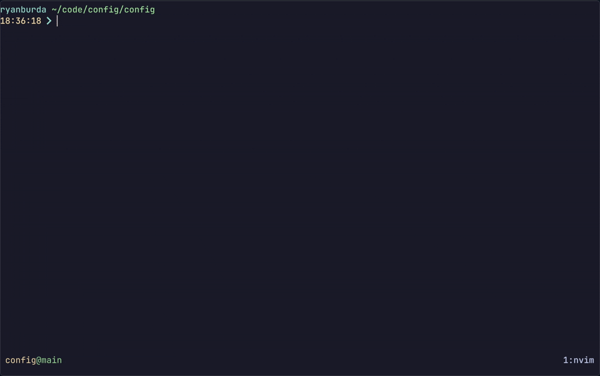
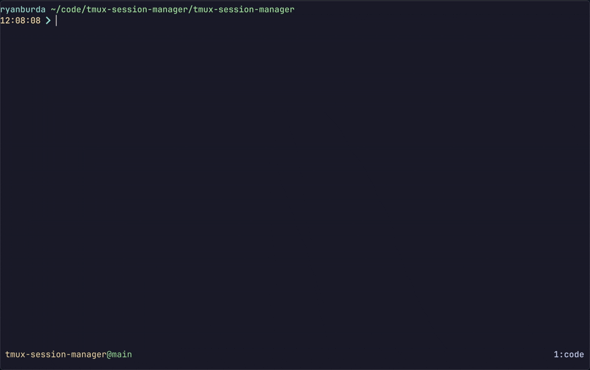
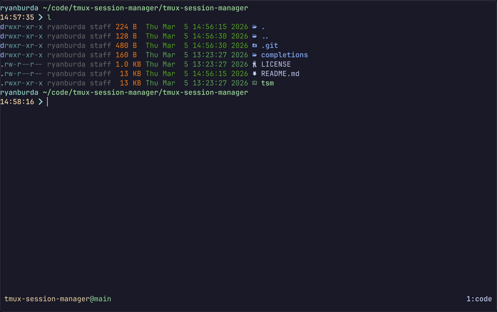

# tmux-session-manager

Directory-based tmux sessions, configured on creation

- **Create** sessions rooted at directories
- **Script** how your sessions start
- **Switch** between sessions
- **Kill** sessions with background cleanup hooks

Session configurations are executable programs. A shell script, a Python script,
a compiled binary. No YAML, no DSL, no abstraction of any kind.

Write a shared configuration for a familiar setup across a whole tree of projects.

Write custom configurations for projects that need something a bit different.

You just define:
- which directories that configuration claims
- what the session is called
- what to run on startup
- and what to clean up on the way out

`tsm` applies the appropriate configuration based on which directory the session is rooted in.

## Install

### Dependencies

- `fzf`

### Installation
```bash
curl -fsSL https://raw.githubusercontent.com/ryanburda/tmux-session-manager/main/install.sh | sh
```

The command above:
- Clones the repository to `${XDG_DATA_HOME:-~/.local/share}/tmux-session-manager`
- symlinks `tsm` into `~/.local/bin`

Re-run it at any time to update to the latest revision.

Shell completions are not installed by the script. See Shell Completions section below.

<details>
<summary><strong style="font-size: 1.25em;">Custom Installation</strong></summary>

Two environment variables change where things land:
- `TSM_HOME` is where the repository is cloned
- `BIN_DIR` is where the `tsm` symlink is placed

Set either or both on the `sh` that runs the script:

```bash
curl -fsSL https://raw.githubusercontent.com/ryanburda/tmux-session-manager/main/install.sh \
  | TSM_HOME=~/src/tsm BIN_DIR=~/bin sh
```
</details>

<details>
<summary><strong style="font-size: 1.25em;">Manual Installation</strong></summary>

1. Clone the repository:
   ```bash
   git clone https://github.com/ryanburda/tmux-session-manager.git ~/git/ryanburda/tmux-session-manager
   ```

2. Symlink the script to a directory in your PATH:
   ```bash
   mkdir -p ~/.local/bin
   ln -s ~/git/ryanburda/tmux-session-manager/tsm ~/.local/bin/tsm
   ```

3. Ensure `~/.local/bin` is in your PATH. Add this to your `.bashrc` or `.zshrc` if needed:
   ```bash
   export PATH="$HOME/.local/bin:$PATH"
   ```

</details>

<details>
<summary><strong style="font-size: 1.25em;">Shell Completions</strong></summary>

Completions provide:
- Active session names for `tsm active` and `tsm kill`
- Directory completion for `tsm dir`
- Session names with logs for `tsm logs`

The paths below are the install script's checkout location. If you overrode `TSM_HOME`, or cloned
manually, substitute that directory instead.

<details>
<summary><strong>Bash</strong></summary>

Add to your <code>~/.bashrc</code>:

```bash
source ~/.local/share/tmux-session-manager/completions/tsm.bash
```

</details>

<details>
<summary><strong>Zsh</strong></summary>

Add to your <code>~/.zshrc</code>:

```bash
fpath=(~/.local/share/tmux-session-manager/completions $fpath)
autoload -Uz compinit && compinit
```
Or rename `tsm.zsh` to `_tsm` and place in an existing fpath directory.

</details>

<details>
<summary><strong>Fish</strong></summary>

Symlink to fish completions directory:

```bash
ln -s ~/.local/share/tmux-session-manager/completions/tsm.fish ~/.config/fish/completions/
```

</details>

</details>

<details>
<summary><strong style="font-size: 1.25em;">tmux Keybindings</strong></summary>

`tsm` is best used with tmux keybinds which can be added to your `~/.tmux.conf`:

```bash
bind-key s popup -E "tsm active"
bind-key k popup -E "tsm kill"
bind-key X run-shell "tsm kill #{session_name}"
bind-key l run-shell "tsm last"

# Directory based sessions
bind-key d popup -E "tsm dir"
bind-key g popup -E "tsm git"
bind-key G popup -E "tsm git -bf"
bind-key w popup -E "tsm worktree"
bind-key b run-shell -b "tsm bookmark"
bind-key B popup -E "tsm bookmark-list -f"
bind-key m run-shell -b "tsm bookmark-add"
bind-key M run-shell -b "tsm bookmark-remove"

# Session logs
bind-key L popup -E "tsm logs"
```

This maps:
- `prefix + s` - Active session switcher
- `prefix + k` - Kill session selector
- `prefix + X` - Kill the current session and run its `kill` hook
- `prefix + l` - Switch to the most recent session that is still open
- `prefix + d` - Directory session launcher
- `prefix + g` - Git repository session launcher
- `prefix + G` - Git repository session launcher (with git brief)
- `prefix + w` - Worktree session launcher
- `prefix + b` - Bookmarked directory session launcher, asking for the character in the status line
- `prefix + B` - Bookmarked directory session launcher, browsing with fzf
- `prefix + m` - Bookmark the session's directory, asking for the character in the status line
- `prefix + M` - Remove a bookmark, asking for the character in the status line
- `prefix + L` - Browse session logs

The three bindings that ask for a character use `run-shell` rather than `popup -E`: the prompt is
tmux's own, shown in the status line, so there is no popup to put it in. `tsm bookmark-add` bound
this way bookmarks the directory the session is rooted at. To bookmark the directory the current
pane is in instead, pass it: `bind-key m run-shell -b "tsm bookmark-add '' '#{pane_current_path}'"`.

<details>
<summary><strong style="font-size: 1.25em;">Troubleshooting Keybinds</strong></summary>

> tmux's `run-shell` and `popup -E` commands execute in a non-interactive, non-login shell.
> For `tsm` to be found, it must be in your PATH when this shell starts.
> 
> **For zsh users:** Add your PATH configuration to `~/.zshenv` (not `.zshrc`).
> 
> **For bash users:** Set the `BASH_ENV` environment variable to point to a file that configures your PATH,
> or add your PATH to `/etc/environment`.
> 
> **Shell startup file precedence:**
> 
> | Shell | Login | Interactive | Non-interactive |
> |-------|-------|-------------|-----------------|
> | **zsh** | zshenv → zprofile → zshrc → zlogin | zshenv → zshrc | zshenv only |
> | **bash** | /etc/profile → (~/.bash_profile OR ~/.bash_login OR ~/.profile) | ~/.bashrc | $BASH_ENV only (if set) |
> 
> Since tmux runs commands non-interactively, zsh only sources `~/.zshenv` and bash only sources the file
> specified by `$BASH_ENV` (if set). This is why PATH modifications in `.zshrc` or `.bashrc` won't apply.
> 
> **Fallback:** If configuring shell startup files isn't working, you can execute `tsm` using its full path
> in your keybindings:
> 
> ```bash
> bind-key s popup -h 24 -w 60 -E "~/.local/share/tmux-session-manager/tsm"
> bind-key d popup -h 24 -w 80 -E "~/.local/share/tmux-session-manager/tsm dir"
> bind-key X run-shell "~/.local/share/tmux-session-manager/tsm kill #{session_name}"
> ```
> 
> Adjust the path if the repository lives somewhere else.
> 
> **Note:** If you specify a custom `TSM_DIRS_CMD`, add it to the same file where you configure your PATH
> (e.g., `~/.zshenv` for zsh). Otherwise, `tsm dir` will use the default directory list in a tmux popup
> but a different custom list from an interactive shell, leading to inconsistent behavior.

</details>

</details>

## Usage

```bash
tsm                                  # Show help message
tsm active [session]                 # Switch to session
tsm kill [session]                   # Kill session (runs its kill hook if present)
tsm last                             # Switch to the most recent session that is still open

tsm dir [path] [-c] [-p]             # Create session at path
tsm git [-b] [-f] [-c] [-p]          # Browse git repositories with fzf, creates session at path
tsm worktree [name] [-c] [-p]        # Create session at git worktree path
tsm bookmark [char] [-c] [-p]        # Create session at a bookmarked directory (prompts for char)

  -c, --no-config                    # Ignore any configuration claiming the selected path
  -p, --prompt-name                  # Prompt for the session name instead of using the default
  -b, --brief                        # (git) Show git status information in the picker
  -f, --fetch                        # (git) Fetch before showing the brief; implies -b

tsm bookmark-add [char] [path]       # Bookmark a directory (prompts for char; path defaults to the current directory)
tsm bookmark-remove [char]           # Remove a bookmark (prompts for char)
tsm bookmark-list [-f]               # List bookmarks (-f, --fzf browses them with fzf and starts a session)
tsm bookmark-status [path]           # Bookmarks of the open sessions, for a tmux status line

tsm match [path]                     # Configurations claiming a path, best first (defaults to the current directory)
tsm logs [session]                   # Browse session logs
tsm apply-matching-config            # Apply the matching configuration's start (inside a configuration's start)
tsm kill-matching-config             # Run the matching configuration's kill (inside a configuration's kill)

tsm help                             # Show help message
```

## Session Configuration Setup

`tsm` allows you to define configurations for your sessions. A session configuration is an
executable program in `${XDG_CONFIG_HOME:-~/.config}/tsm/`. There is no DSL or YAML abstraction over
tmux to learn. `man tmux` is the reference for all of it. Anything a program can do, a session
configuration can do.

`tsm` runs the program with a verb and reads its answer. That is the whole contract, so a
configuration can be written in any language you like — bash, zsh, fish, Python, or a compiled
binary:

| Verb | Called when | Answer |
|---|---|---|
| `pattern` | resolving which configuration claims a directory | print an ERE of the directories claimed, on stdout |
| `name` | naming the session **(Optional)** | print the session name for the directory given as `$2`, on stdout |
| `start` | after tmux has created the session | build the layout |
| `kill` | when the session is killed **(Optional)** | tear down what `start` built |

Two rules make it work in every language:

- **Only `pattern` and `name` treat stdout as an answer.** For `start` and `kill`, stdout is the
  session log (`tsm logs <session>`).
- **A verb the program does not handle must exit 0.** That is how "no hook for this" is said — the
  `case` simply falls through, and the default applies.

`SESSION` is in the environment for every verb but `name`, which is the verb that decides it. `ROOT`
is the claimed directory, and is there for every verb but `pattern`, which is asked before any
particular directory has been settled on.

The file's name, minus any extension, identifies the configuration in logs and in error messages.
The extension is for your editor's benefit, not `tsm`'s, so `myproject`, `myproject.sh` and
`myproject.fish` are all the configuration `myproject`. **The file must be executable** — that is
what makes it a configuration, and it is what keeps a stray README in the directory from being
mistaken for one.

```bash
#!/bin/bash
# ~/.config/tsm/work.sh   (chmod +x)
#
# the layout for every repository directly under ~/code/work

case "$1" in
  pattern)
    printf '%s\n' "^$HOME/code/work/[^/]+$"
    ;;

  start)
    vim=$(tmux display-message -p -t "$SESSION" '#{pane_id}')
    ai=$(tmux split-window -P -F '#{pane_id}' -h -l 35% -t "$vim" -c "$ROOT")
    tmux send-keys -t "$vim" 'vim' Enter
    tmux send-keys -t "$ai" 'ai' Enter
    ;;
esac
```

The script above:
- claims every repository directly under `~/code/work`
- splits the pane the session starts with into two
- puts your editor on the left
- puts your ai on the right

`pattern` is a POSIX extended regular expression tested against the resolved directory you picked,
not a glob. It is how one file describes a whole tree without a file per repository. To claim a
single directory, anchor both ends:

```bash
  pattern)
    printf '%s\n' "^$HOME/code/myproject$"
    ;;
```

When more than one `pattern` claims a directory, **the longest pattern wins** — see
[precedence](docs/building-a-session.md#precedence), and `tsm match <path>` to see the ranking for
any directory. A directory no `pattern` claims gets a bare session. To get a default for everything,
add a configuration answering `pattern` with `.*`; at two characters it is the shortest pattern
there is, so it only ever wins where nothing else matched.

A configuration that matches first does not inherit the one behind it. It opts in by calling
`tsm apply-matching-config` under `start` and `tsm kill-matching-config` under `kill`, which run the
*next* configuration that also claims the directory. That leaves it free to run its own work before
or after the shared setup, and a chain of them keeps falling through.

See **[Building a Session](docs/building-a-session.md)** for the full guide: pane addressing,
multi-window layouts, naming, starting and stopping services, worked examples, and the same
configuration written in fish and Python.

# Overview

## Directory Sessions

Each directory session picker shown below opens a tmux session rooted at
a directory you pick. There are various pickers differing only in how they
help you find the directory:

- `tsm dir` - any directory on the filesystem
- `tsm git` - a git repository
- `tsm worktree` - a worktree of the current repository
- `tsm bookmark` - a directory you have bookmarked to a single character

Once a directory is picked, every picker resolves it the same way:

```
          ----------------------------------------
          | tsm dir  ·  tsm git  ·  tsm worktree |
          ----------------------------------------
                            |
                   --------------------
                   | picked directory |
                   --------------------
                            |
        ------------------------------------------
        | is a session already open at the path? |
        ------------------------------------------
             /                                \
         -------                            ------
         | yes |                            | no |
         -------                            ------
            |                                  |
    ------------------      ------------------------------------
    | switch to it   |      | does a configuration answer      |
    ------------------      | `pattern` matching the path?     |
                            ------------------------------------
                              /                          \
                           -------                     ------
                           | yes |                     | no |
                           -------                     ------
                             |                            |
             ---------------------------    -------------------------
             | name the session with   |    | name the session from |
             | that configuration's    |    | the directory, create |
             | `name`, create it, then |    |    a bare session     |
             | run its `start`         |    -------------------------
             ---------------------------
```

The first question is about the path, not the name. A session is identified by the directory it was
started at, recorded on the session itself, so picking a directory you already have open returns to
that session however it has since been renamed.

All four pickers take the same flags:

- `-c`, `--no-config` - Ignore the configuration claiming the picked directory entirely — both its
  `name` and its `start` — leaving a bare session named after the directory.
- `-p`, `--prompt-name` - Prompt for the session name instead of using the suggested one. See
  [Session names](#session-names).

Each picker also takes an argument (a path, a worktree name, a bookmark character) to skip the
picker and go straight to a session.

See [Usage](#usage) for the exact arguments.

### Session names

A picker names the session after the directory it starts at: the sanitized basename, or
`repo/worktree` inside a git worktree, where `repo` is the directory the repository lives in and
`worktree` is the basename of the worktree's own path.

```
~/code/api                        ->  api
~/code/project/.bare              ->  (the repository)
~/code/project/feature            ->  project/feature
```

Sanitizing replaces every character outside `[A-Za-z0-9_-/]` with `_`, so a worktree on a branch
like `v1.2` becomes `project/v1_2`. `/` survives, because that is what joins the two halves of a
worktree name. `.` and `:` do not: tmux target syntax is `session:window.pane`, so a session holding
either could be created and then never switched to or killed again.

#### A session is its directory, not its name

`tsm` records the directory a session was started at on the session itself, in a `@tsm_path` tmux
option. That record, rather than the name, is what identifies the session:

- Picking a directory that already has a session open **switches to it** — that is the point of
  picking it again — and keeps doing so after `tmux rename-session`, or after a configuration starts
  naming things differently.
- Two *different* directories whose names land on the same string is the opposite problem.
  `~/code/api` and `~/work/api` are both `api`, and switching to the first when you picked the
  second would silently take you somewhere you did not ask for. So it is reported and you are asked
  for a name:

```
$ tsm dir ~/work/api
Session name collision
  name              api
  new session at    /home/you/work/api
  'api' is open at  /home/you/code/api
Enter session name:
```

Anything you type there is used as-is, minus the `.` and `:` refusal above. `/` is fine.

Sessions started outside `tsm`, or before `@tsm_path` existed, fall back to tmux's own
`#{session_path}`, so picking their directory still finds them.

#### Naming a session yourself

`-p` takes the name into your own hands for one session, in any of the four pickers:

```sh
tsm dir -p ~/work/api    # suggests "api"; enter accepts it, anything else replaces it
```

The suggestion is whatever the rules produced — a configuration's `name` if one had an opinion,
the directory otherwise — so pressing enter accepts it and anything typed replaces it. `-p` is the
last word either way.

It has nothing to do when the path already has a session, though: there is no session being created
to name, so `-p` switches to the existing one like any other pick.

### Naming sessions from a configuration (`name`)

`-p` renames one session by hand. The `name` verb replaces the derivation for every directory a
configuration claims:

```bash
#!/bin/bash
# ~/.config/tsm/work.sh   (chmod +x)

case "$1" in
  pattern)
    printf '%s\n' "^$HOME/code/work/"
    ;;

  name)
    echo "work/$(basename "$2")"
    ;;
esac
```

The directory arrives both as `$2` and as `$ROOT`. Only the first line of output is used, with
surrounding whitespace trimmed.

A configuration that does not handle `name` at all, or that prints nothing, or that fails, gets the
default derivation. A naming scheme with no opinion about a particular directory is a normal thing
to write, and it should not wedge the pickers. Whatever it does print is **sanitized** rather than
refused — a name is usually derived from a branch or a directory, neither of which the configuration
controls, and `feature/v1.2` is a reasonable thing to hand back.

Because the name comes from the configuration that claimed the directory, it only applies where that
configuration's `pattern` reaches. Directories claimed by nothing keep the default derivation.

<details>
<summary><strong style="font-size: 1.25em;">Examples</strong></summary>

> Name worktree sessions after their branch rather than their directory. git allows a branch to be
> checked out in only one worktree at a time, so a branch is unique across a repository by
> construction:
>
> ```bash
>   name)
>     git -C "$2" branch --show-current 2>/dev/null
>     ;;
> ```
>
> No `tr` is needed: a branch name routinely contains `/` and `.`, and sanitizing turns the `.` into
> `_` while leaving the `/` alone. Note that this trades one kind of staleness for another — the
> session keeps the name of whatever branch was checked out when it started, and a worktree you
> re-branch keeps the old name until you kill the session. It suits a worktree-per-branch workflow,
> not a durable worktree you move between branches.
>
> Let a directory name itself, falling back to the default when it does not:
>
> ```bash
>   name)
>     cat "$2/.tsm-name" 2>/dev/null
>     ;;
> ```
>
> `cat` fails on a directory with no `.tsm-name`, which is exactly the fallback contract: the named
> directories get their names, everything else is derived as usual.
>
> Put a whole tree under one prefix, so the status line groups them:
>
> ```bash
>   name)
>     echo "work/$(basename "$2")"
>     ;;
> ```
>
> This is also the way to make a collision stop happening. `~/code/api` and `~/work/api` collide on
> `api`; a configuration claiming `^$HOME/work/` and naming `work/$(basename "$2")` makes the second
> one `work/api`, and neither ever prompts again.

</details>

> ### Directory (`tsm dir`)
>
> Any directory on the filesystem.
>
> By default fzf displays non-hidden directories within 4 levels of your `$HOME` directory, stopping
> at the root of each git repository. This can be changed by setting the `TSM_DIRS_CMD` environment
> variable in your `.bashrc/.zshenv`.
>
> <details>
> <summary><strong style="font-size: 1.25em;">Modifying <code>TSM_DIRS_CMD</code></strong></summary>
>
> > `TSM_DIRS_CMD` can be set to any command that returns directories.
> >
> > The following example shows:
> > - directories 1 level deep in the `$HOME` directory
> > - directories 4 levels deep in `$HOME/code` while also pruning the search once it finds the root of a git repo
> >
> > ```bash
> > export TSM_DIRS_CMD='{
> >   find "$HOME" -maxdepth 1 -name ".*" -prune -o -type d -print;
> >   find "$HOME/code" -maxdepth 4 -name ".*" -prune -o -type d \( -exec test -e {}/.git \; -print -prune -o -print \);
> > }'
> > ```
> </details>
>
> 

> ### Git Repositories (`tsm git`)
>
> A git repository.
>
> By default `tsm git` finds all directories containing `.git` within 4 levels of `$HOME`. This can
> be changed by setting the `TSM_GIT_DIRS_CMD` environment variable in your `.bashrc/.zshenv`.
>
> Two flags are specific to this picker:
> - `-b`, `--brief` - Show git status information in the picker. Off by default so the picker
>   appears immediately.
> - `-f`, `--fetch` - Run `git fetch` before displaying status, so the ahead/behind counts reflect
>   the latest remote tracking info. Implies `-b`.
>
> With `-f`, the fetches run in parallel, 8 repositories at a time. `TSM_GIT_FETCH_JOBS` raises or
> lowers that cap:
> 
> <details>
> <summary><strong style="font-size: 1.25em;">Modifying <code>TSM_GIT_DIRS_CMD/TSM_GIT_FETCH_JOBS</code></strong></summary>
> 
> > `TSM_GIT_DIRS_CMD` can be set to any command that returns directories of git repositories.
> >
> > It is a good idea to limit this search to a directory where you keep your projects:
> > ```bash
> > export TSM_GIT_DIRS_CMD='find "$HOME/code" -maxdepth 4 -name ".git" 2>/dev/null | sed "s/\/\.git$//"'
> > ```
> >
> > The `TSM_GIT_FETCH_JOBS` cap matters because every fetch also opens a connection to a remote. Lower it if a wide
> > `TSM_GIT_DIRS_CMD` makes the picker slow to appear or your connection is metered, or drop `-f`
> > to skip fetching altogether.
> >
> > ```bash
> > export TSM_GIT_FETCH_JOBS=4
> > ```
> </details>
>
> 

<a id="git-worktrees"></a>

> ### Git Worktrees (`tsm worktree`)
>
> A worktree of the current repository, in a session named
> [`repo/worktree`](#session-names), where `repo` is the directory the repository lives in and
> `worktree` is the basename of the worktree's path.
>
> **NOTE:** Can only be run when the current working directory is inside a git repo
> 
> 

<a id="bookmarks"></a>

> ### Bookmarks (`tsm bookmark`)
>
> A directory you have bookmarked, keyed by a single character.
>
> A bookmark maps one character to one directory. `tsm bookmark m` goes straight to a session
> at whatever directory `m` is bookmarking, with no picker in the way. Bookmarks are meant for
> the handful of directories you return to constantly, the ones worth recalling from memory
> instead of fuzzy finding for.
>
> | command | description |
> |---------|-------------|
> | `tsm bookmark <char> [-c] [-p]` | Start a session at the directory bookmarked at `<char>` |
> | `tsm bookmark [-c] [-p]` | Ask for a character, then start a session at its directory |
>
> The session that starts is a directory session like any other: the configuration whose `pattern`
> claims the bookmarked directory names and builds it if one does, and `-c` and `-p` mean what they
> mean for the other pickers.
>
> The bookmarks themselves are managed with three commands of their own:
>
> | command | description |
> |---------|-------------|
> | `tsm bookmark-add [char] [path]` | Bookmark a directory at `<char>`, defaulting to the current directory |
> | `tsm bookmark-remove [char]` | Remove the bookmark at `<char>` |
> | `tsm bookmark-list [-f]` | List all bookmarks, or browse them with `fzf` |
> | `tsm bookmark-status [path]` | The open sessions' bookmarks, for a tmux status line |
>
> A bookmark character is a single printable character. Bookmarking a directory at a character
> that is already bookmarked replaces it, the way setting a vim mark that is already set does.
>
> Called without a character, `tsm bookmark`, `tsm bookmark-add` and `tsm bookmark-remove` ask for
> one and take the next key pressed, the way vim's `m{char}` does. `enter` or `escape` backs out.
> This is what makes them worth binding to a tmux key: the binding does not have to carry a
> character, so one key covers every bookmark.
>
> Inside tmux the question is asked in the status line, so a binding needs no popup to hold it.
> Using `run-shell` is enough. Answering it is what starts the session, or sets or removes the
> bookmark. Outside tmux the character is read from the terminal instead.
>
> - `-f`, `--fzf` - (`bookmark-list`) Browse the bookmarks with `fzf` instead of printing them.
>   Each row is a bookmark's character and its directory; `enter` starts a session at the one
>   picked, and `ctrl-x` removes it without leaving the picker. This is the way back when a
>   character will not come to mind.
>
> Bookmarks are stored as JSON in `${XDG_STATE_HOME:-~/.local/state}/tsm/bookmarks.json`.
>
> #### Status Line (`tsm bookmark-status`)
>
> `tsm bookmark-status` prints the bookmark characters of the sessions that are **open**, for a
> tmux status line:
>
> ```tmux
> set -g status-right "#(tsm bookmark-status '#{session_path}')"
> ```
>
> The character of the session you are in is styled differently from the rest. This is the compact
> alternative to reading session names off a status line. A bookmark you have set but have no
> session open for is not shown. The line only contains the bookmarked sessions you are focusing on
> right now.
>
> Two flags set the styles. They are tmux style specifications written without their `#[]`
> wrapper, so that nothing in the status line format needs escaping:
>
> | flag | description |
> |------|-------------|
> | `-s`, `--style` | Style for the other open sessions' characters (default: `dim`) |
> | `-c`, `--current-style` | Style for the current session's character (default: `fg=yellow,bold`) |
>
> ```tmux
> set -g status-right "#(tsm bookmark-status '#{session_path}' -s 'fg=colour244' -c 'fg=black,bg=blue,bold')"
> ```
>
> A status line is otherwise only redrawn every `status-interval` seconds, so a session opened or
> killed somewhere else would take until the next tick to appear or go away. Two hooks close that
> gap:
>
> ```tmux
> set-hook -g session-created 'run-shell -b "tsm _refresh-status"'
> set-hook -g session-closed 'run-shell -b "tsm _refresh-status"'
> ```
>
> `tsm _refresh-status` redraws the status line of **every** attached client, re-running the
> commands in it. Every client, because tmux's own `refresh-client -S` reaches only the client the
> hook fired for, and passing `#{session_path}` gives each client a `#()` job of its own. So
> refreshing one client's line leaves the others showing what they showed before.
>
> Switching sessions needs no hook: that redraws the client's status line by itself, and the
> character that is highlighted follows along. Setting or removing a bookmark needs none either since
> `tsm bookmark-add` and `tsm bookmark-remove` refresh the line themselves.

## Active Session Switcher

Browse the sessions that are currently running and switch to one.



## Last Session (`tsm last`)

`tsm last` switches to the most recently visited session that is still open.
This is like `tmux switch-client -l`, but it keeps looking further back in history
instead of failing outright when the previous session has since been closed.

This only works if tmux tells `tsm` about session switches as they happen, so it
requires one addition to `~/.tmux.conf`:

```tmux
set-hook -g client-session-changed 'run-shell "tsm _record-switch #{q:client_last_session} #{q:client_session}"'
```
This allows all session switches, not just ones made through `tsm`, appear in the history file.
Without this hook, `tsm last` has nothing to work from and will tell you so.

## License

MIT

## Contributing

Contributions are welcome! Please feel free to submit a Pull Request.
