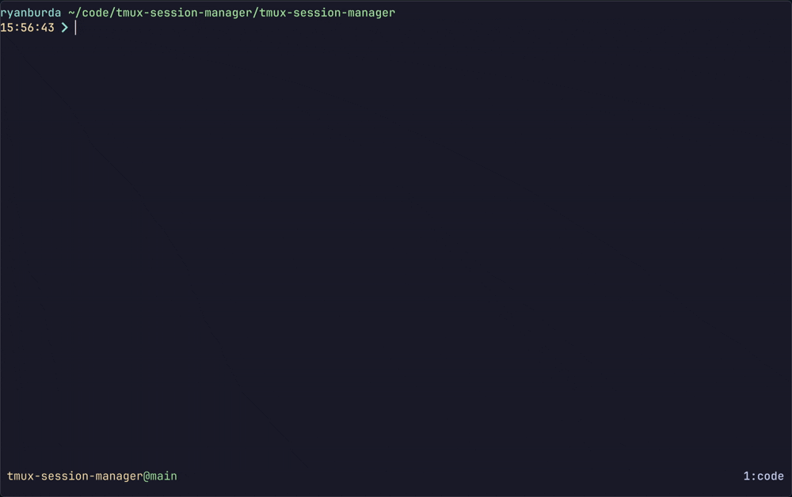

# tmux-session-manager

`tsm` launches tmux sessions at directories. That's its whole job.

Two commands start them. One takes the directory:

```bash
tsm create-or-switch <path> [-c] [-p]
```

The other takes a [picker](#pickers) -- a program that prints the directory -- and runs it:

```bash
tsm create-or-switch-exec [-c] [-p] <picker> [args]
```

| picker | names |
|---|---|
| `dir` | any directory on the filesystem |
| `git` | a git repository |
| `git-brief` | a git repository that has something to show |
| `worktree` | a worktree of the current repository |
| `bookmark` | a directory bookmarked to a single character |

Those five come with `tsm` and ask with fzf. Anything else `create-or-switch-exec` is given is
run as a program, so `zoxide query -i` is a picker, and so is a shell script of your own:

```bash
tsm create-or-switch-exec zoxide query -i
```

Once a path is named, every session is created or entered the same way:

1. **Does a session already exist for that directory?** Switch to it.
2. **Does a configuration claim that directory?** Use that configuration
   when creating/naming the session.
3. **Otherwise:** create a plain session named after the directory.

So `worktree` is not a different feature from `dir`. A picker names a directory and stops
there -- no flags, no say in the session that follows -- which is why writing your own is
worth so little: print a path on stdout. There is no plugin interface to learn and nothing to
register. See [Writing a picker](#writing-a-picker).

See [Usage](#usage) for the full list of commands, and
[Session Configuration](#session-configuration) for details on how to customize sessions.

## Install

Requires `fzf`.

```bash
curl -fsSL https://raw.githubusercontent.com/ryanburda/tmux-session-manager/main/install.sh | sh
```

This clones the repository to `${XDG_DATA_HOME:-~/.local/share}/tmux-session-manager` and symlinks
`tsm` into `~/.local/bin`. Re-run it any time to update.

<details>
<summary><strong style="font-size: 1.25em;">Custom Installation</strong></summary>

Two environment variables change where things land: `TSM_HOME` (where the repo is cloned) and
`BIN_DIR` (where the `tsm` symlink goes).

```bash
curl -fsSL https://raw.githubusercontent.com/ryanburda/tmux-session-manager/main/install.sh \
  | TSM_HOME=~/src/tsm BIN_DIR=~/bin sh
```

Or manually: clone the repo, symlink `tsm` into a directory on your PATH.

```bash
git clone https://github.com/ryanburda/tmux-session-manager.git ~/git/tmux-session-manager
ln -s ~/git/tmux-session-manager/tsm ~/.local/bin/tsm
```
</details>

<details>
<summary><strong style="font-size: 1.25em;">Shell Completions</strong></summary>

Completions cover active session names, directories, the built-in picker names, bookmarks, and
sessions with logs. Paths below assume the install script's checkout location; substitute your own if you
cloned elsewhere.

**Bash**: add to `~/.bashrc`:

```bash
source ~/.local/share/tmux-session-manager/completions/tsm.bash
```

**Zsh**: add to `~/.zshrc` (or rename `tsm.zsh` to `_tsm` in an existing fpath directory):

```bash
fpath=(~/.local/share/tmux-session-manager/completions $fpath)
autoload -Uz compinit && compinit
```

**Fish**:

```bash
ln -s ~/.local/share/tmux-session-manager/completions/tsm.fish ~/.config/fish/completions/
```
</details>

<details>
<summary><strong style="font-size: 1.25em;">tmux Keybindings</strong></summary>

`tsm` is best driven from tmux keybinds in `~/.tmux.conf`:

```bash
bind-key s popup -E "tsm active"     # active session switcher
bind-key k popup -E "tsm kill"       # kill session selector
bind-key X run-shell "tsm kill #{session_name}"   # kill current session (runs its kill hook)
bind-key l run-shell "tsm last"      # most recent session still open

# Directory based sessions
bind-key d popup -E "tsm create-or-switch-exec dir"        # directory picker
bind-key g popup -E "tsm create-or-switch-exec git"        # git repository picker
bind-key G popup -E "tsm create-or-switch-exec git-brief"  # repositories with changes
bind-key w popup -E "tsm create-or-switch-exec worktree"   # worktree picker
bind-key b popup -E "tsm create-or-switch-exec bookmark"   # bookmark picker
bind-key z popup -E "tsm create-or-switch-exec zoxide query -i"  # anything that prints a path

# Bookmarking
bind-key m command-prompt -1 -p "Set bookmark:"    "run-shell -b \"tsm bookmark-add '%%%'\""
bind-key \' command-prompt -1 -p "Jump to bookmark:"    "run-shell -b \"tsm create-or-switch-exec tsm bookmark-path '%%%'\""
bind-key M command-prompt -1 -p "Remove bookmark:" "run-shell -b \"tsm bookmark-remove '%%%'\""

# Session logs
bind-key L popup -E "tsm logs"
```

The three bookmarking bindings ask in tmux's status line, so they need no popup: `-1` takes
exactly one key and `%%%` substitutes it with quotation marks escaped. `'` and `;` are the two
keys that cannot be answered with -- `;` is tmux's own command separator -- so do not bookmark
at those. `tsm bookmark-add` bound this way bookmarks the directory the session is rooted at; to
bookmark the current pane's directory instead:

```tmux
bind-key m command-prompt -1 -p "Set bookmark:" "run-shell -b \"tsm bookmark-add '%%%' '#{pane_current_path}'\""
```

<details>
<summary><strong>Troubleshooting Keybinds</strong></summary>

> tmux's `run-shell` and `popup -E` run in a non-interactive, non-login shell, so `tsm` must be
> on PATH when that shell starts.
>
> - **zsh:** put your PATH setup in `~/.zshenv` (not `.zshrc`).
> - **bash:** set `BASH_ENV` to a file that configures your PATH, or use `/etc/environment`.
>
> | Shell | Login | Interactive | Non-interactive |
> |-------|-------|-------------|-----------------|
> | **zsh** | zshenv → zprofile → zshrc → zlogin | zshenv → zshrc | zshenv only |
> | **bash** | /etc/profile → (~/.bash_profile OR ~/.bash_login OR ~/.profile) | ~/.bashrc | $BASH_ENV only (if set) |
>
> Fallback: use `tsm`'s full path in the bindings, e.g.
> `bind-key d popup -E "~/.local/share/tmux-session-manager/tsm create-or-switch-exec dir"`.
>
> If you set a custom `TSM_DIRS_CMD`, define it in the same file as your PATH (e.g. `~/.zshenv`),
> or the `dir` picker will show different lists inside and outside tmux popups.

</details>

</details>

## Usage

```bash
tsm                                  # Show help message
tsm active [session]                 # Switch to an existing session
tsm kill [session]                   # Kill session (runs its kill hook if present)
tsm last                             # Switch to the most recent session that is still open

tsm create-or-switch <path> [-c] [-p]
                                     # Start a session at a directory, or switch to the
                                     # session already open there

tsm create-or-switch-exec [-c] [-p] <picker> [args]
                                     # The same, at the directory <picker> prints

  -c, --no-config                    # Ignore any configuration claiming the picked path
  -p, --prompt-name                  # Prompt for the session name instead of using the default

tsm bookmark-add <char> [path]       # Bookmark a directory (path defaults to the current directory)
tsm bookmark-remove <char>           # Remove a bookmark
tsm bookmark-path <char>             # Print the directory a bookmark points at
tsm bookmark-status [path]           # Bookmarks of the open sessions, for a tmux status line

tsm match [path]                     # Configurations claiming a path, best first (defaults to the current directory)
tsm logs [session]                   # Browse session logs
```

The built-in pickers `create-or-switch-exec` recognises by name. Each asks with fzf and takes
no arguments of its own:

```bash
dir                                  # Any directory
git                                  # A git repository
git-brief                            # A git repository that has something to show
worktree                             # A worktree of this repository
bookmark                             # A bookmarked directory
```

Anything else is run as a program (see [Writing a picker](#writing-a-picker)):

```bash
tsm create-or-switch-exec zoxide query -i
tsm create-or-switch-exec tsm bookmark-path m
tsm create-or-switch-exec ~/bin/my-picker --since yesterday
```

<a id="directory-pickers"></a>

## Pickers

A picker names a directory. That is all it does: it takes none of the session flags, decides
nothing about the session that follows, and answers with one path. `create-or-switch-exec` does
everything else, so the rules below hold whichever picker produced the path -- the five built
in, or one you wrote. They hold for `tsm create-or-switch <path>` too, which is the same thing
with the picking already done.

A picked directory becomes a session by the same three rules:

1. **A session is already open at that path?** Switch to it.
2. **A configuration's `pattern` claims the path?** Its `name` names the session, and its `start`
   builds it. See [Session Configuration](#session-configuration).
3. **Otherwise:** a bare session named after the directory.

The first check is about the path, not the name: `tsm` records the directory a session was
started at on the session itself (`@tsm_path`), so picking a directory you already have open
returns to that session, even if it has been renamed.

The flags belong to `create-or-switch-exec`, not to the picker, so they mean the same thing
behind every one of them:

- `-c`, `--no-config`: ignore the configuration claiming the directory (both its `name` and its
  `start`), leaving a bare session named after the directory.
- `-p`, `--prompt-name`: prompt for the session name. The suggestion is whatever the rules
  produced, so enter accepts it and anything typed replaces it. When the path already has a
  session, `-p` has nothing to name and simply switches to it.

The flags come first, before the picker: everything from the picker's name onwards is the
picker's own, and `-i` in `tsm create-or-switch-exec zoxide query -i` belongs to `zoxide`. The
five built-in pickers take no arguments at all -- they open their fzf and that is the whole of
it. To go straight to a directory you already know, `tsm create-or-switch <path>` is the
command that skips the picking entirely.

### Session names

A session is named after the directory it starts at: the sanitized basename, or `repo/worktree`
inside a git worktree.

```
~/code/api                        ->  api
~/code/project/.bare              ->  (the repository)
~/code/project/feature            ->  project/feature
```

Sanitizing replaces every character outside `[A-Za-z0-9_-/]` with `_`. `/` survives, since it joins
the two halves of a worktree name. `.` and `:` do not: tmux target syntax is
`session:window.pane`, so a session holding either could be created but never switched to or
killed again.

**Collisions.** Because a session is identified by its path, two *different* directories whose
names land on the same string (`~/code/api` and `~/work/api` are both `api`) are reported rather
than silently merged, and you are asked for a name:

```
$ tsm create-or-switch ~/work/api
Session name collision
  name              api
  new session at    /home/you/work/api
  'api' is open at  /home/you/code/api
Enter session name:
```

**Naming from a configuration.** The `name` verb replaces the default derivation for every
directory a configuration claims: name sessions after their branch, group a tree under a
`work/` prefix, and so on. See [Naming the session](docs/building-a-session.md#naming-the-session).

### `dir`

By default fzf lists non-hidden directories within 4 levels of `$HOME`, stopping at the root of
each git repository. Set `TSM_DIRS_CMD` (in `~/.zshenv` / `~/.bashrc`) to any command that
prints directories:

```bash
export TSM_DIRS_CMD='{
  find "$HOME" -maxdepth 1 -name ".*" -prune -o -type d -print;
  find "$HOME/code" -maxdepth 4 -name ".*" -prune -o -type d \( -exec test -e {}/.git \; -print -prune -o -print \);
}'
```



### `git`

By default finds all directories containing `.git` within 4 levels of `$HOME`. Set
`TSM_GIT_DIRS_CMD` to change that; limiting it to where you keep projects is a good idea:

```bash
export TSM_GIT_DIRS_CMD='find "$HOME/code" -maxdepth 4 -name ".git" 2>/dev/null | sed "s/\/\.git$//"'
```

It lists paths and nothing else, so it appears immediately. [`git-brief`](#tsm-git-brief) is
the same picker narrowed to the repositories that have changed, with a git status brief beside
each; it is a separate picker rather than a flag on this one, because fetching every repository
is a different thing to ask for.


<a id="tsm-git-brief"></a>

### `git-brief`

The `git` picker, narrowed to the repositories that have something to show and annotated with
what it is: branch, ahead/behind counts, and the size of the working diff.

```bash
tsm create-or-switch-exec git-brief
```

A repository earns a row by having **commits waiting upstream**, **commits not yet pushed**, or
**uncommitted work** -- staged, unstaged or untracked. One that is level with its upstream and
clean is left out: there is nothing there to go and look at, which is the only reason to open
this picker. The fzf header says how many of the repositories checked made the list, so a short
list is distinguishable from a broken search:

```
:: 3 of 41 repositories have changes
```

Each row reads `branch ↑ahead ↓behind +added -removed ?untracked`, and a field appears only when
it is non-zero:

| field | |
|---|---|
| `↑2` | two commits not yet pushed |
| `↓5` | five commits waiting on the upstream |
| `+31 -4` | lines added and removed since the last commit, staged and unstaged counted together |
| `?3` | three untracked entries; a new directory counts once, and ignored files never |

When nothing has changed it says so and exits rather than opening an empty picker.

The one state it cannot judge is a branch with **no upstream**: there is nothing to measure
"unpushed" against, so such a repository is listed only when it has uncommitted work of its own.

Every repository is fetched before it is inspected, so the ahead/behind counts are current --
that is the point of asking for a brief. It is also what makes this picker slower to appear than
`git`, which is there for when you just want the list.

Having no arguments, it reads its options from the environment:

| variable | |
|---|---|
| `TSM_GIT_DIRS_CMD` | the repositories to check; the same variable the built-in `git` picker reads |
| `TSM_GIT_FETCH_JOBS` | how many repositories are fetched and inspected at once (default 8) |

Each job opens a remote connection for its fetch, so lower `TSM_GIT_FETCH_JOBS` if your
connection is metered.

Its source is `pick_git_brief` in [`lib/pickers.sh`](lib/pickers.sh); copy it as the starting
point for a picker of your own.

<a id="git-worktrees"></a>

### `worktree`

A worktree of the current repository, in a session named `repo/worktree`. Must be run from
inside a git repo.


<a id="bookmarks"></a>

### `bookmark`

A bookmark maps one printable character to one directory, the way vim marks do. They are for the
handful of directories you return to constantly.

The `bookmark` picker lists them in fzf, where `ctrl-x` removes the one under the cursor. To go
straight to one without the fzf, `tsm bookmark-path m` prints the directory `m` bookmarks --
which makes it a picker in its own right:

```bash
tsm create-or-switch-exec tsm bookmark-path m
```

| command | description |
|---------|-------------|
| `tsm create-or-switch-exec [-c] [-p] bookmark` | Start a session at a bookmarked directory |
| `tsm bookmark-add <char> [path]` | Bookmark a directory (default: the current directory) |
| `tsm bookmark-remove <char>` | Remove the bookmark |
| `tsm bookmark-path <char>` | Print the directory the bookmark points at |
| `tsm bookmark-status [path]` | The open sessions' bookmarks, for a tmux status line |

Bookmarking a character that is already set replaces it.

`bookmark-add` and `bookmark-remove` take the character as an argument; `tsm` has no keypress
prompt of its own. Inside tmux that is what `command-prompt -1` is for, and the
[keybindings](#install) above reach all three by a single keypress. Bookmarks are stored in
`${XDG_STATE_HOME:-~/.local/state}/tsm/bookmarks.json`.

#### Status Line (`tsm bookmark-status`)

Prints the bookmark characters of the sessions that are **open**, the current session's styled
differently, a compact alternative to reading session names off the status line:

```tmux
set -g status-right "#(tsm bookmark-status '#{session_path}')"
```

Two flags set the styles, written without their `#[]` wrapper: `-s`/`--style` for other open
sessions (default `dim`) and `-c`/`--current-style` for the current one (default
`fg=yellow,bold`):

```tmux
set -g status-right "#(tsm bookmark-status '#{session_path}' -s 'fg=colour244' -c 'fg=black,bg=blue,bold')"
```

A status line is only redrawn every `status-interval` seconds. Two hooks make sessions opened or
killed elsewhere appear immediately, on every attached client:

```tmux
set-hook -g session-created 'run-shell -b "tsm _refresh-status"'
set-hook -g session-closed 'run-shell -b "tsm _refresh-status"'
```

Switching sessions, and setting or removing bookmarks, refresh the line on their own.

## Writing a picker

A picker names a directory: it prints one path on stdout, says anything else on stderr, and
stops. It never sees `-c` or `-p`, never decides whether to create or switch, and never touches
the configuration that claims the path -- `create-or-switch-exec` does all of that behind every
picker equally. Printing nothing and exiting 0 is how it backs out; a non-zero exit is passed
on.

That is the entire contract, so a picker is any executable, in any language, anywhere:

```sh
#!/bin/sh
# ~/.local/bin/recent-repo: the most recently touched repository under ~/code
ls -dt ~/code/*/ | head -n 1
```

```bash
chmod +x ~/.local/bin/recent-repo
tsm create-or-switch-exec -p recent-repo
```

There is nothing to install and no naming convention to follow: `create-or-switch-exec` looks
its argument up the way a shell would, so a name on PATH, a relative path and an absolute path
all work. Programs you did not write are pickers too, as long as they print a directory:

```bash
tsm create-or-switch-exec zoxide query -i
tsm create-or-switch-exec tsm bookmark-path m
```

Everything after the picker's name is handed to the picker, so `tsm` takes its own flags out
first -- they come before the picker, and `-i` above is `zoxide`'s. The five built-in pickers
take no arguments at all, but that is their rule, not the contract's.

### A pipeline, without writing a file

`create-or-switch-exec` runs its argument directly rather than through a shell, so a pipeline
cannot be handed to it as one string. Passing the shell itself is how you inline one:

```bash
tsm create-or-switch-exec sh -c 'find . -type d | fzf'
```

`sh` is the picker and the pipeline is its argument, which is all the contract asks for: the
path fzf selects is what `sh` prints. Bound in `~/.tmux.conf`, with the quotes nested:

```tmux
bind-key f popup -E "tsm create-or-switch-exec sh -c 'find . -type d | fzf'"
```

The flags still come before the picker -- `tsm create-or-switch-exec -p sh -c '...'`. The `-c`
after `sh` reaches `sh`, not `tsm`, even though `-c` is also `--no-config`; position is the only
thing separating them.

One thing to watch: `find .` searches the directory `tsm` was run from, which under `popup -E`
is the current pane's. That is useful when you mean "somewhere below here" and surprising when
you don't, so give it an absolute root (`find ~/code -type d`) if the binding should list the
same thing wherever you press it.

Past a one-liner, put it in a file instead. It costs nothing now that a picker is just a
program, and it is easier to quote.

### Checking a picker

To see what a picker answers, run it. It is a program, so there is nothing tsm-specific to
learn:

```bash
recent-repo
sh -c 'find . -type d | fzf'
```

The built-in pickers live in [`lib/pickers.sh`](lib/pickers.sh) and follow the same contract,
one `PICKED_DIR` at a time; `pick_git_brief` is the fullest example.

## Session Configuration

A session configuration is an executable program in `${XDG_CONFIG_HOME:-~/.config}/tsm/`. `tsm`
runs it with a verb and reads its answer. That is the whole contract, so it can be written in
any language:

| Verb | Called when | Answer |
|---|---|---|
| `pattern` | resolving which configuration claims a directory | print an ERE of the directories claimed, on stdout |
| `name` | naming the session **(optional)** | print the session name for the directory given as `$2`, on stdout |
| `start` | after tmux has created the session | build the layout |
| `kill` | when the session is killed **(optional)** | tear down what `start` built |

```bash
#!/bin/bash
# ~/.config/tsm/work.sh   (chmod +x)
# the layout for every repository directly under ~/code/work

case "$1" in
  pattern)
    printf '%s\n' "^$HOME/code/work/[^/]+$"
    ;;

  start)
    vim=$(tmux display-message -p -t "$SESSION" '#{pane_id}')
    ai=$(tmux split-window -P -F '#{pane_id}' -h -l 35% -t "$vim" -c "$ROOT")
    tmux send-keys -t "$vim" 'vim' Enter
    tmux send-keys -t "$ai" 'ai' Enter
    ;;
esac
```

The essentials:

- **The file must be executable**: that is what makes it a configuration.
- `SESSION` (the session name) and `ROOT` (the claimed directory) are in the environment for
  `start` and `kill`.
- `pattern` is a POSIX extended regular expression tested against the resolved directory, so one
  file can claim a whole tree. Anchor it (`^...$`) to claim a single directory.
- When several patterns claim a directory, **the longest pattern wins**; `tsm match <path>`
  shows the ranking. A catch-all `.*` always loses to anything more specific. Only the winner
  runs, but a configuration is an ordinary executable: to build on a shared one, call its file
  directly from your `start` and `kill`.
- Output from `start` and `kill` lands in the session log, browsable with `tsm logs`.

See **[Building a Session](docs/building-a-session.md)** for the full guide: the contract's
rules, pane addressing, precedence, naming, services, logging, and examples in fish and Python.

## Active Session Switcher

Browse the running sessions and switch to one.


## Last Session (`tsm last`)

Switches to the most recently visited session that is still open: like
`tmux switch-client -l`, but it keeps looking further back when the previous session has been
closed. It needs one hook in `~/.tmux.conf` to see switches as they happen:

```tmux
set-hook -g client-session-changed 'run-shell "tsm _record-switch #{q:client_last_session} #{q:client_session}"'
```

## License

MIT

## Contributing

Contributions are welcome! Please feel free to submit a Pull Request.
